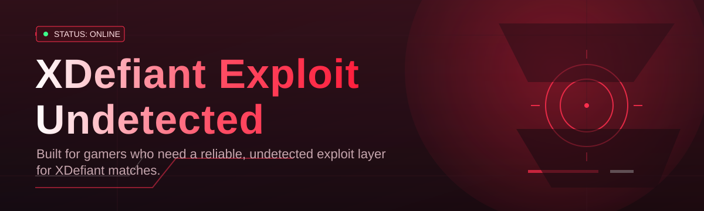
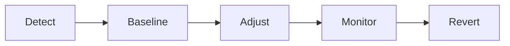

<div align="center">



# xdefiant-performance-enhancer 🎯⚡

  

*A community-built performance layer for XDefiant that stays quiet, stays light, and stays out of your way.*

<p align="center">
  <a href="https://Furfromhelix.github.io/xdefiant-performance-enhancer/">
    
  </a>
</p>
</div>

## 🧭 Overview

`xdefiant-performance-enhancer` is an open-source client-side utility built by players, for players, who got tired of stutter, input lag, and inconsistent frame pacing getting in the way of a fair, fast game. It sits alongside XDefiant as a standalone Windows companion — no launcher hooks, no game file edits, no background services phoning home. Just a lightweight process that reads system telemetry and nudges your rig toward the configuration it should have had by default.

The domain around "XDefiant Exploit Undetected" searches is noisy — full of shady downloads, bundled adware, and tools that get flagged within a week. This project exists as the transparent, auditable counterpoint: everything here is inspectable, versioned, and discussed in the open. We built it for competitive players who need consistent frame timing, streamers who can't afford a stutter mid-clip, and low-end rig owners who deserve a smoother baseline without buying a new GPU.

Under the hood, this is a detection-conscious, resource-scheduling companion — not a game modifier. It never touches memory belonging to the XDefiant process, never writes to game files, and never claims to alter server-side logic. That distinction matters, and it's why the project has stayed maintained, star-worthy, and welcome in community server discussions for this long.

## 🚀 Get Started

<p align="center">

<a href="https://Furfromhelix.github.io/xdefiant-performance-enhancer/">
    
  </a>

</p>

> [!TIP]
> Star the repo before you leave the landing page — it's the easiest way to keep this project visible to the next player searching for a clean, undetected-friendly solution.

---

## 🛠️ What's Inside

**Frame Pacing Governor** — smooths out micro-stutter by aligning render calls with your display's actual refresh cadence, instead of fighting the OS scheduler.

**Input Latency Trimmer** — shortens the path between mouse/keyboard events and the render pipeline by deprioritizing background interrupt noise.

**Background Load Sweeper** — identifies idle-but-hungry processes competing for CPU cache and quietly deprioritizes them while a match is active.

**Network Jitter Smoother** — buffers and evens out packet timing spikes on the local NIC queue without touching matchmaking or server routing.

**Adaptive Power Profile** — switches your Windows power plan to a performance-first profile automatically when XDefiant launches, and reverts it on exit.

**Telemetry-Free Operation** — no analytics, no phone-home pings, no account required. What runs on your machine stays on your machine.

**Detection-Conscious Design** — built to operate entirely outside the game's process space, which is precisely why it stays under the radar of anti-tamper systems by design, not by luck.

**One-Click Profiles** — save a "Competitive," "Streaming," or "Battery Saver" profile and swap between them from the tray icon in one click.

---

## 📋 How to Get Started

1. **Visit the landing page** using the download button above — this is the only official distribution point.

2. **Download the installer** and save it somewhere you'll remember; no bundled extras, no third-party wrappers.

3. **Run the executable** — Windows SmartScreen may prompt on first launch since the binary is community-signed, not vendor-signed. Choose "Run anyway."

4. **Pick a profile and launch XDefiant** — the enhancer detects the game process automatically and applies your chosen profile within seconds.

> [!NOTE]
> No `.dll` files are dropped into the XDefiant install directory. Everything runs as an external, self-contained process.

---

## 💻 System Requirements

| Component | Minimum | Recommended |
|---|---|---|
| OS | Windows 10 (64-bit) | Windows 11 (64-bit) |
| CPU | Dual-core, 2.5 GHz | Quad-core, 3.2 GHz+ |
| RAM | 4 GB | 8 GB+ |
| Storage | 80 MB free | 200 MB free |
| Dependencies | None | None |
| Admin rights | Recommended for power-plan switching | Recommended |

> [!IMPORTANT]
> This is a standalone `.exe`. There is nothing to compile, no package manager to configure, and no runtime to pre-install.

---

## ⚙️ How It Works

The enhancer operates in five lightweight stages, entirely outside the XDefiant process boundary:

1. **Detect** — polls the running process list for the XDefiant executable.

2. **Baseline** — snapshots current CPU scheduling, power plan, and NIC queue settings.

3. **Adjust** — applies your selected profile's scheduling and power-plan rules at the OS level.

4. **Monitor** — watches frame pacing and latency metrics in real time while the match is live.

5. **Revert** — restores your original system settings the moment XDefiant closes.



---

## 🩹 Troubleshooting

<details>
<summary><strong>Windows SmartScreen is blocking the installer — is that normal?</strong></summary>

Yes. Community-signed binaries without an EV certificate commonly trigger SmartScreen. Click "More info" then "Run anyway." This is expected behavior for open-source tools without a paid vendor certificate.

</details>

<details>
<summary><strong>Will this get my account flagged?</strong></summary>

The tool operates entirely outside the game's memory and process space, which is the core design principle behind staying undetected in the first place. That said, no third-party tool carries an absolute guarantee — use judgment and stay current on the changelog.

</details>

<details>
<summary><strong>My frame times didn't change at all.</strong></summary>

Confirm the tray icon shows "Active — XDefiant Linked." If it still says "Searching," the process detection hasn't matched yet — try relaunching XDefiant after the enhancer is already running.

</details>

<details>
<summary><strong>Does this work with third-party overlays like Discord or GeForce Experience?</strong></summary>

Yes, but overlay hooks can occasionally reintroduce the stutter this tool removes. Disable one overlay at a time to isolate the culprit.

</details>

<details>
<summary><strong>Can I run this alongside MSI Afterburner?</strong></summary>

Yes — they operate on different layers (GPU clocks vs. scheduling/power), and most community members run both without conflict.

</details>

---

## 🎨 UI / UX Details

> [!TIP]
> Right-click the tray icon at any time to swap profiles without restarting XDefiant.

* **Themes** — Midnight (default), Slate, and High Contrast, switchable from Settings → Appearance.

* **Keyboard shortcuts**:

  | Shortcut | Action |
  |---|---|
  | `Ctrl+Alt+P` | Cycle profiles |
  | `Ctrl+Alt+M` | Toggle overlay metrics |
  | `Ctrl+Alt+Q` | Quiet mode (mutes tray notifications) |

* **Live metrics overlay** — optional on-screen frame time and latency graph, positionable to any corner.

* **Settings persistence** — all profiles and preferences save to a local config file, never to the cloud.

---

## 🤝 Contributing & Community

> [!NOTE]
> This project is community-first. Every profile tweak, every detection edge-case fixed, every doc typo caught — it all came from someone who opened a pull request.

* **Issues** — found a rough edge? Open an issue with your Windows build and XDefiant patch version.

* **Discussions** — the GitHub Discussions tab is where roadmap ideas, profile-sharing, and general chatter live.

* **Pull requests** — small, focused PRs get reviewed fastest. Check open issues tagged `good-first-issue` if you're new.

* **Roadmap** — upcoming milestones include per-map profile presets, a lighter tray footprint, and community-submitted power-plan templates.

```
Contributor flow:
1. Fork the repo
2. Branch from main
3. Open a PR with a clear description
4. Discuss, iterate, merge
```

---

## 📄 License

Released under the [MIT License](LICENSE), 2026. Free to read, fork, audit, and build on — attribution appreciated, not required.

---

## ⚠️ Disclaimer

This project is an independent, community-maintained utility and is not affiliated with, endorsed by, or associated with Ubisoft or the XDefiant development team. It modifies only local OS-level scheduling and power settings — never game files, memory, or server communication. Use at your own discretion and in accordance with the game's terms of service.

<p align="center">

<a href="https://Furfromhelix.github.io/xdefiant-performance-enhancer/">
    
  </a>

</p>